# IEEE-Demo
A UI/X for the IEEE student branch website where branch's needs were translated into clearly written user stories resulting into the UI displayed below.

**Note**: The images displayed above are part of a real-world project and are not available as open-source material. These images are for demonstration purposes only, and the content is proprietary to the project owner. Redistribution or use outside of the intended context is prohibited without permission.

# Landing Page

# Auth Flow
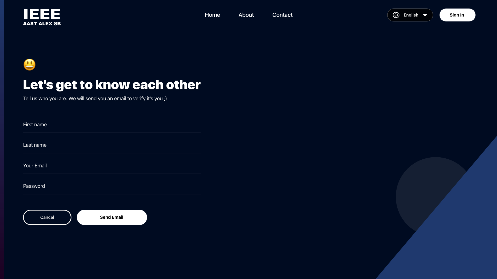
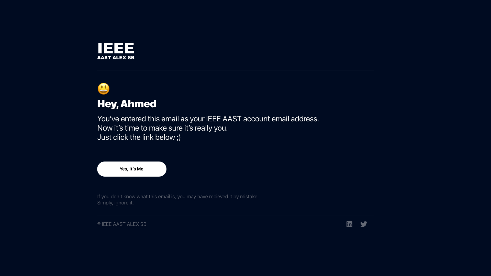
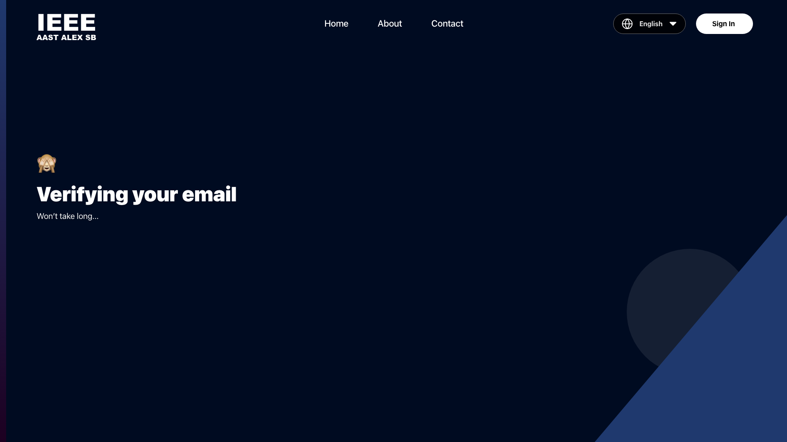
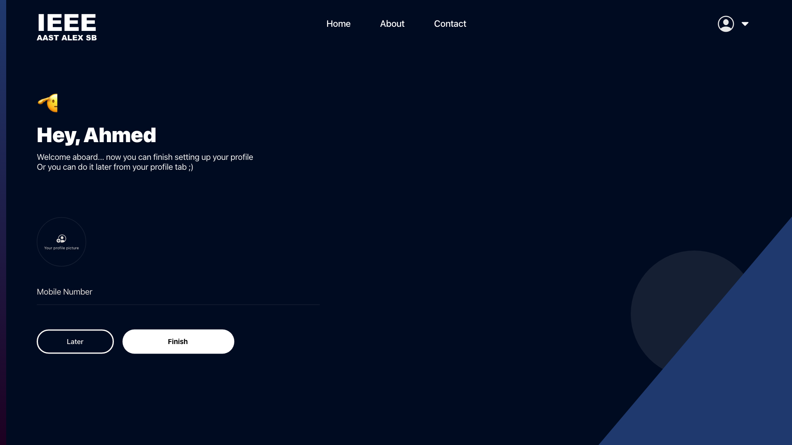
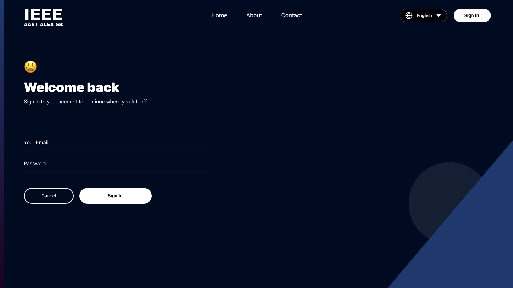

# Authenticated Home
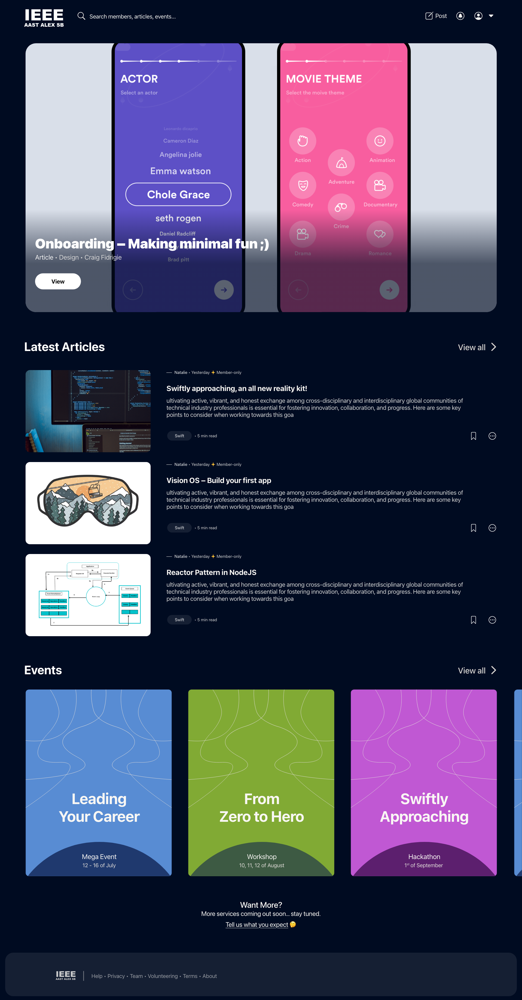

# Event Preview
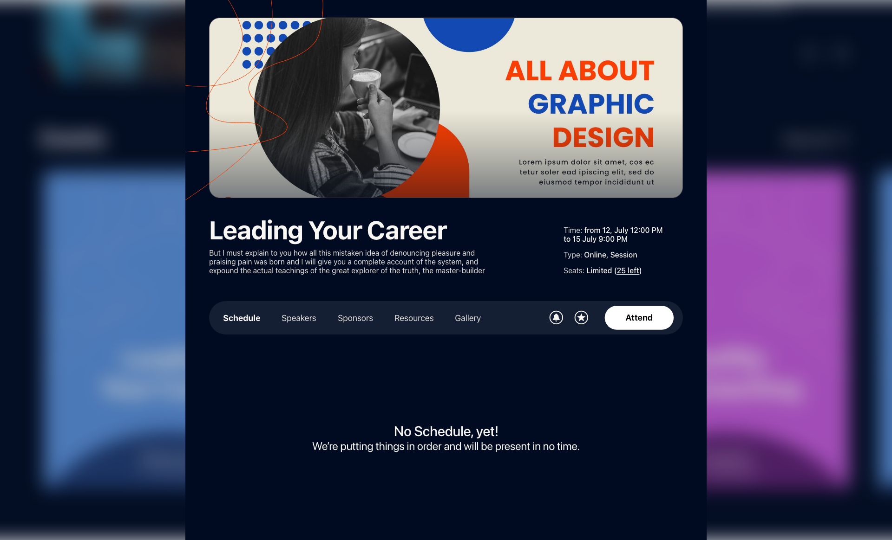
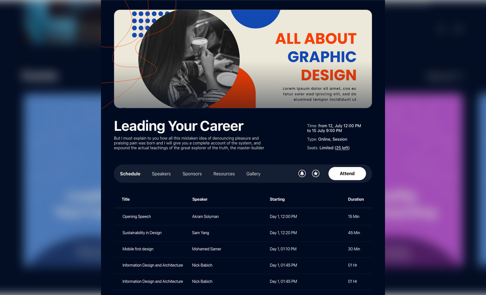

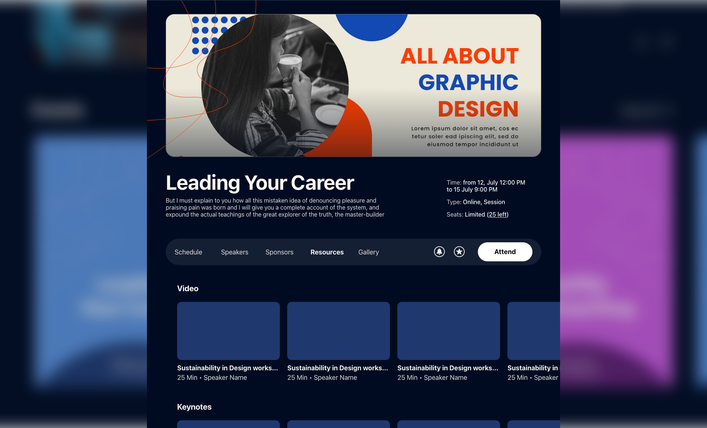
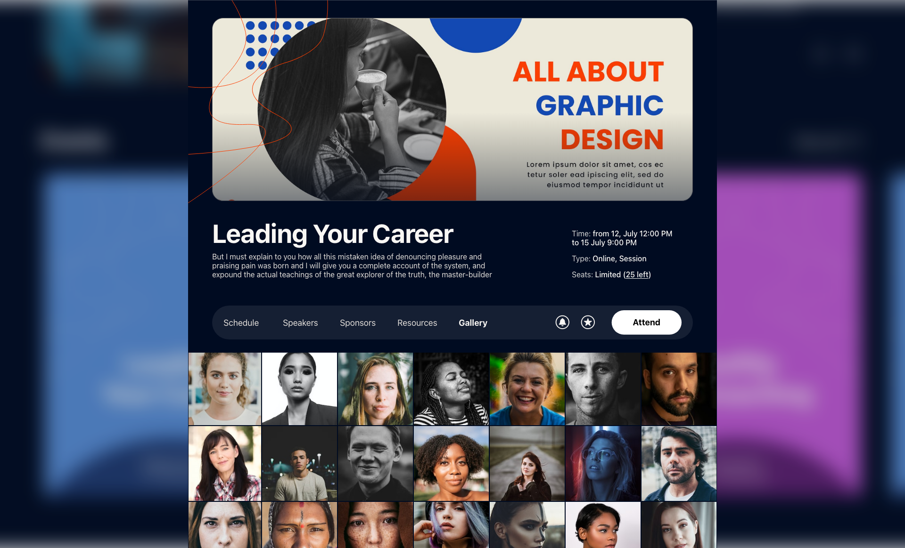

# Article Page
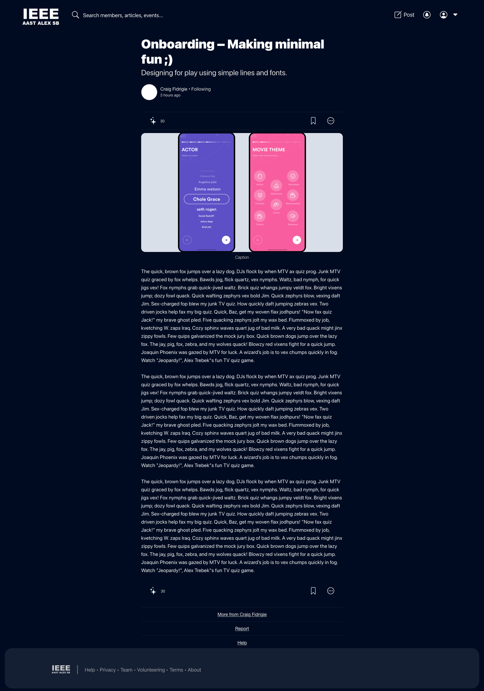

# Profile Page
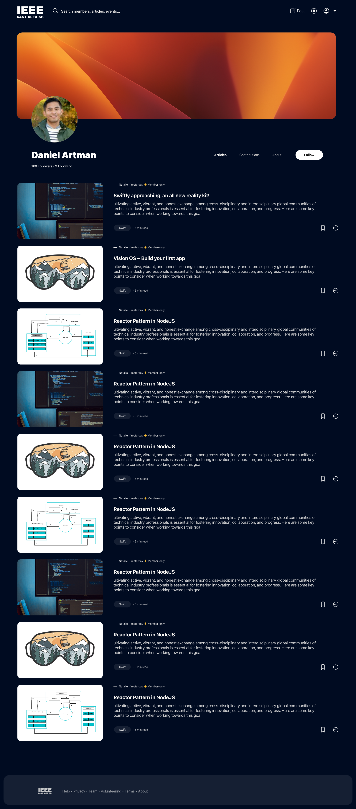
